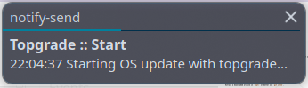

# Topgrade wrapper

**Linux bash script** for cronjob using **notify-send** to show a notification to the main desktop user when topgrade starts and ends.

* The notification disappears after a few seconds if everything is OK or 
* stays until you click on the error message. 

So you stay informed if something goes wrong.

👤 Author: Axel Hahn \
📄 Source: <https://github.com/axelhahn/bash-topgrade-wrapper> \
📜 License: GNU GPL 3.0

**Related links**:

* [Topgrade](https://github.com/topgrade-rs/topgrade)

## 👉🏼 Requirements

* Linux
* topgrade
* sudo permission for your desktop user (for topgrade)
* notify-send (topgrade will start if it is not installed - but then you won't need this wrapper)

## 🖥️ Installation

Extract a downloaded archive in `/opt/` or better use `git clone`.

As root:

```txt
cd /opt
git clone https://github.com/axelhahn/bash-topgrade-wrapper topgrade-wrapper
```

No configuration is needed.

## 💡 Usage

### ⌨️ Interactive test

For a first test in a terminal start the script with **your user**.

```txt
/opt/topgrade-wrapper/start_topgrade.sh

── 22:04:37 - System update ────────────────────────────────────────────────────
Warning: Building packages as dynamic user
Warning: Setting build directory to /var/cache/pamac
Preparing...
Synchronizing package databases...                                            
(...)
```

You should see a disappearing notification box as well:



If the script ends you get a notification again. 

* It is a disappearing notification on success or 
* an error message on failure that stays on the screen until clicking on it.

### 🕓 Cronjob

Create a cronjob eg. as file in `/etc/cron.d/`.

In your cronjob

* Execute the wrapper script as user that has sudo permissions
* Redirect the output

**Example**:

```txt
50 8,12,16,20 * * * axel /opt/topgrade-wrapper/start_topgrade.sh >/tmp/topgrade.log 2>&1
```

OR

When starting the job as root

* Add a variable `SUDO_USER=<your-user>` to set a target user for notification

```txt
SUDO_USER=axel
50 8,12,16,20 * * * root /opt/topgrade-wrapper/start_topgrade.sh >/tmp/topgrade.log 2>&1
```

I prefer my **Cronwrapper** to simplify monitoring all cronjobs

📗 Docs: see https://www.axel-hahn.de/docs/cronwrapper/ 

Then it can look like this:

```txt
50 8,12,16,20 * * * axel /opt/cronwrapper.sh 1440 "/opt/topgrade-wrapper/start_topgrade.sh" 'os-update'
```
